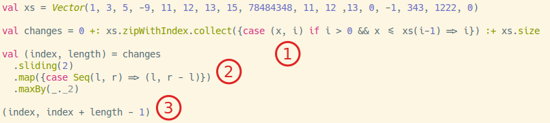

# Scala Solution

The basic solution is as follows:

1. Find all the indexes where where a new range starts. I also want the book-ends, `0` and `xs.size`. In this particular case, my data structure will look like this: `Vector(0, 3, 9, 12, 13, 16, 17)`. The way I do this is I first zip the input `xs` with their index. That gives me a `Seq` or tuples `(x, index)`. I then `collect` the index where the current value `x` is less than the value before it.

2. Now that I have `Vector(0, 3, 9, 12, 13, 16, 17)`, I simply have to measure the gaps between each pair. I do this by mapping over the vector using a window of size 2 `sliding(2)` and generating a new tuple of index and length `=> (l, r - l)`, and finally just find the max by the length `maxBy(_._2)`, which gives me `(3,6)`.

3. Because the answer calls for the two indexes, I can calculate the end index by add the length to the index `(index, index + length-1)`.

Answer is `(3,8)`.

You can run a play with the solution [here](https://scalafiddle.io/sf/wpqRL2J/0) if you don't want to download this code. The code in this repository is a little different in that it is more general; it uses the [Ordering trait (typeclass)] to support other types.(https://www.scala-lang.org/api/2.12.3/scala/math/Ordering.html) that's defined in the standard library. I also extracted the partial function to better show you how the collect function works. I could have used `filter`, but I chose `collect` because I didn't need the entire tuple.
