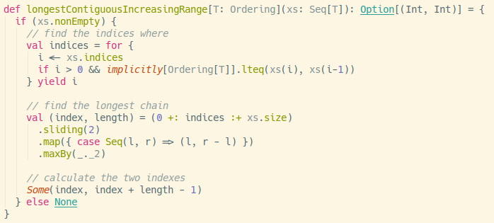

# Scala Solution

The basic solution is as follows:

## 1. Using Collect with a Partial Function

1. Find all the indices where a new range starts. I also want the book-ends, `0` and `xs.size`. In this particular case, the resulting data structure will look like this: `Vector(0, 3, 9, 12, 13, 16, 17)`. I accomplish this by first zipping the input `xs` with the index. That gives me a `Seq` of tuples `(x, index)`. I then `collect` the index where the current value `x` is less than the value before it.

2. Now that I have `Vector(0, 3, 9, 12, 13, 16, 17)`, I simply have to measure the gaps between each pair. I do this by mapping over the vector using a window of size 2 `sliding(2)` and generating a new tuple of index and length `=> (l, r - l)`. Then I find the max by the length `maxBy(_._2)`, which gives me `(3,6)`.

3. Because the answer calls for the two indexes, I can calculate the end index by add the length to the index `(index, index + length-1)`.

Answer is `(3,8)`.

If you have [sbt](https://www.scala-sbt.org/) installed, you can run the tests by `sbt test` from the `scala` folder.

If you'd rather not install sbt, I created a [Scala Fiddle](https://scalafiddle.io/sf/wpqRL2J/0) where you can run and play with the code. The code in the repository is a little different in that it is more general; it uses the [Ordering trait (typeclass)](https://www.scala-lang.org/api/2.12.3/scala/math/Ordering.html) to support other types. I also extracted the partial function to better show you how the collect function works. I could have used `filter`, but I chose `collect` because I didn't need the entire tuple. Either one can work.

## 2. Using Map & Filter

Some might find this a little easier to read. I replace the `zipWithIndex.collect` with a simple `for..yield`, which is just sugar for map and filter.

